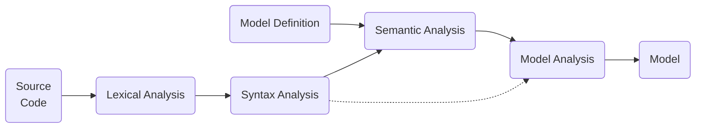

---
# try also 'default' to start simple
theme: seriph
titleTemplate: '%s'
# random image from a curated Unsplash collection by Anthony
# like them? see https://unsplash.com/collections/94734566/slidev
background: https://source.unsplash.com/collection/94734566/1920x1080
# apply any windi css classes to the current slide
class: 'text-center'
colorSchema: 'light'
# https://sli.dev/custom/highlighters.html
highlighter: shiki
# show line numbers in code blocks
lineNumbers: false
# some information about the slides, markdown enabled
info: |
  ## Slidev Starter Template
  Presentation slides for developers.

  Learn more at [Sli.dev](https://sli.dev)
---

# Model recovery for Commerce Runtime

How to get high level stuff from the low level stuff

<div class="abs-br m-6 flex gap-2">
  <a href="https://github.com/andreesteve" target="_blank" alt="GitHub"
    class="text-xl icon-btn opacity-50 !border-none !hover:text-white">
    <carbon-logo-github />
  </a>
</div>


<!--
The last comment block of each slide will be treated as slide notes. It will be visible and editable in Presenter Mode along with the slide. [Read more in the docs](https://sli.dev/guide/syntax.html#notes)
-->

---

# What is model recovery?

- Reverse engineering approach to recover (obtain) models out of the source code
- Models are a representation of a concept / idea / abstraction, e.g.
  - a function call <carbon-arrow-right class="inline-block" /> message passing
  - an piece of memory with a vtable <carbon-arrow-right class="inline-block" /> object

<br>
<br>

<div grid="~ cols-2">
<div v-click>


Model of classes (UML class diagram)

</div>
<div v-click>


Visual Studio recovering class model from source code

</div>
</div>


---

# How model recovery can help with Commerce Runtime development?

<video controls muted loop class="w-11/12">
  <source src="/handyman_visualstudio.webm" />
</video>

---


<div class="abs-br m-6 flex gap-2">
  <a href="https://github.com/andreesteve/crthandyman" target="_blank" alt="GitHub"
    class="text-xl icon-btn opacity-50 !border-none !hover:text-white">
    <carbon-logo-github />
  </a>
</div>

---

# How it works?

<v-click>



</v-click>

<div v-click.hide style="background-color: white" class="absolute left-300px top-100px h-full w-full" />
<div v-click.hide style="background-color: white" class="absolute left-450px top-100px h-full w-full" />
<div v-click.hide style="background-color: white" class="absolute left-250px top-100px h-55px w-200px" />
<div v-click.hide style="background-color: white" class="absolute left-600px top-100px h-full w-full" />

<v-click>

<div class="w-400px h-75px top-40 left-10 absolute rounded-full border-2 border-opacity-50 border-red-500" />
<div class="w-150px h-50px top-26 left-112 absolute rounded-full border-2 border-opacity-50 border-red-500" />


</v-click>

<v-click>

<div class="w-150px h-50px top-24 left-72 absolute rounded-full border-2 border-opacity-50 border-blue-500" />
<div class="w-130px h-50px top-33 left-152 absolute rounded-full border-2 border-opacity-50 border-blue-500" />

</v-click>

<br>
<br>
<br>
<br>
<br>

<v-click>

```csharp {1|3|5}
class ExampleService : IRequestHandlerAsync
{
    public IEnumerable<Type> SupportedRequestTypes => new[] { typeof(ExampleRequest) };

    public Task<Response> Execute(Request request) { /* ... */ }
}
```

</v-click>

---
layout: image-right
image: https://source.unsplash.com/w8-Vl-j2-Lc/1920x2984
---

# Now what? What else can we do with it?

Everything starts with <carbon-column-dependency class="inline-block" /> deriving request/request handler dependencies (e.g. call / dependency graph)

- <uim-document-layout-left class="inline-block" /> Generated enhanced documentation
- <carbon-document-unknown class="inline-block" /> What request should one extend (or add a trigger to)?
- <carbon-checkmark-filled class="inline-block" /> Logical backward compatibility checks
- <carbon-logo-delicious class="inline-block" /> Logical checks (does it make sense to call this request here?)

---

# Work in progress

```shell
[andre@scout Handyman.Cli]$ dotnet run -- ../channel/src/Channel.sln Runtime.Services SearchProductsService
Creating workspace...349 ms
Opening solution /home/andre/projects/d365/channel/src/Channel.sln...26343 ms
Compiling project...4386 ms
Starting analysis
Analyzing SearchProductsService.cs
    Is RequestHandler? YES
    Implements:
        * SearchProductsServiceRequest
    Depends on:
        * SearchProductsService.cs:83 -> Execute<?>(RemoteSearchProductsRealtimeRequest)
            |-- implemented by: ProductTransactionServiceRequestHandler.cs:63
        * SearchProductsService.cs:91 -> Execute<?>(RemoteSearchProductsRealtimeRequest)
            |-- implemented by: ProductTransactionServiceRequestHandler.cs:63
        * SearchProductsService.cs:106 -> Execute<?>(GetProductBarcodeDataRequest)
            |-- implemented by: ItemSqlServerDataService.cs:93
        * SearchProductsService.cs:123 -> Execute<?>(GetProductSearchResultsDataRequest)
            |-- implemented by: ProductSearchSqlServerDataService.cs:80
Analysis complete for SearchProductsService.cs...19039 ms
```

---
layout: image-right
image: https://source.unsplash.com/vdhNO4mGQ14/800x600
---

# Interested?

- Open source, clone it on <a href="https://github.com/andreesteve/crthandyman" target="_blank" alt="GitHub" class="text-xl icon-btn"><carbon-logo-github /></a>
- Depends only on CRT's public contracts

<br>
<br>
<br>

### Roadmap
- Visual Studio Code support for finding request implementations
- Request dependency graph discovery
- Dependency graphical rendering
- Nicer logo? 😅

---
layout: center
class: text-center
---

# Thanks!
Questions?
